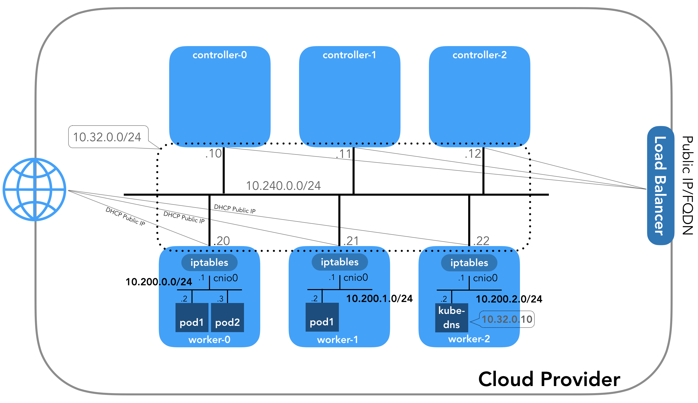

# Kubernetes The Hard Way

:warning: *This is a fork of the original [Kubernetes The Hard Way](https://github.com/kelseyhightower/kubernetes-the-hard-way), I just added the equivalent commands for AWS when required, just so this wasn't a simple copy & paste exercise for me. I took many ideas from [Kubernetes The Hard Way - AWS](https://github.com/DaspawnW/kubernetes-the-hard-way-aws).*

This tutorial walks you through setting up Kubernetes the hard way. This guide is not for people looking for a fully automated command to bring up a Kubernetes cluster. If that's you then check out [Google Kubernetes Engine](https://cloud.google.com/kubernetes-engine), [Amazon EKS](https://aws.amazon.com/eks/) or the [Getting Started Guides](http://kubernetes.io/docs/getting-started-guides/).

Kubernetes The Hard Way is optimized for learning, which means taking the long route to ensure you understand each task required to bootstrap a Kubernetes cluster.

> The results of this tutorial should not be viewed as production ready, and may receive limited support from the community, but don't let that stop you from learning!

## Target Audience

The target audience for this tutorial is someone planning to support a production Kubernetes cluster and wants to understand how everything fits together.

## Cluster Details

Kubernetes The Hard Way guides you through bootstrapping a highly available Kubernetes cluster with end-to-end encryption between components and RBAC authentication.

* [Kubernetes](https://github.com/kubernetes/kubernetes) 1.10.2
* [containerd Container Runtime](https://github.com/containerd/containerd) 1.1.0
* [gVisor](https://github.com/google/gvisor) 08879266fef3a67fac1a77f1ea133c3ac75759dd
* [CNI Container Networking](https://github.com/containernetworking/cni) 0.6.0
* [etcd](https://github.com/coreos/etcd) 3.3.5

## Topology

## Labs

This tutorial assumes you have access to the [Google Cloud Platform](https://cloud.google.com) or [Amazon Web Services](https://aws.amazon.com/). While GCP or AWS are used for basic infrastructure requirements the lessons learned in this tutorial can be applied to other platforms.

* [Prerequisites](docs/01-prerequisites.md)
* [Installing the Client Tools](docs/02-client-tools.md)
* [Provisioning Compute Resources](docs/03-compute-resources.md)
* [Provisioning the CA and Generating TLS Certificates](docs/04-certificate-authority.md)
* [Generating Kubernetes Configuration Files for Authentication](docs/05-kubernetes-configuration-files.md)
* [Generating the Data Encryption Config and Key](docs/06-data-encryption-keys.md)
* [Bootstrapping the etcd Cluster](docs/07-bootstrapping-etcd.md)
* [Bootstrapping the Kubernetes Control Plane](docs/08-bootstrapping-kubernetes-controllers.md)
* [Bootstrapping the Kubernetes Worker Nodes](docs/09-bootstrapping-kubernetes-workers.md)
* [Configuring kubectl for Remote Access](docs/10-configuring-kubectl.md)
* [Provisioning Pod Network Routes](docs/11-pod-network-routes.md)
* [Deploying the DNS Cluster Add-on](docs/12-dns-addon.md)
* [Smoke Test](docs/13-smoke-test.md)
* [Cleaning Up](docs/14-cleanup.md)
